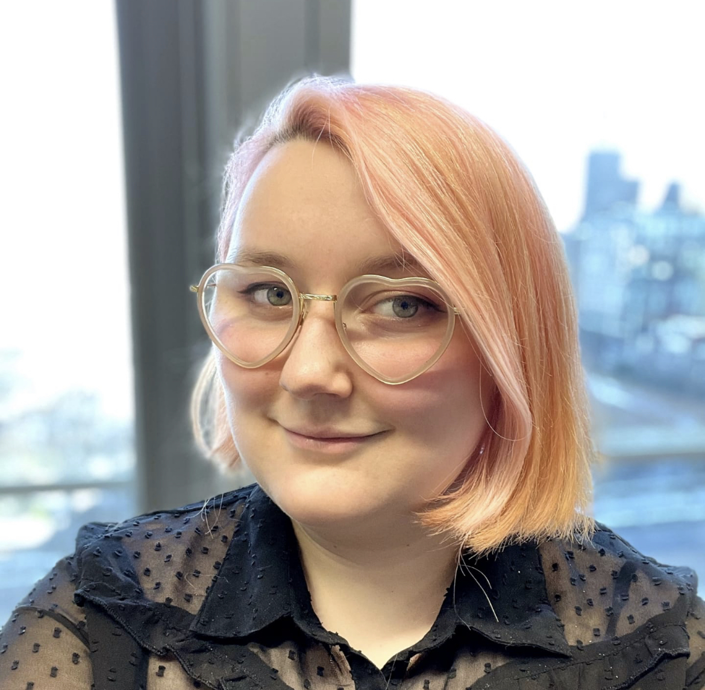

#Danaé Grosjean

*Life finds a way - Ian Malcom*

## I'm Danaé, a design enthousiast and a nerd at heart.

| Q | A |
| ----------- | ----------- |
| Birthday ? | 23/02 (pisces baby :fish:) |
| Favorite color ? | duh... pink ! |
| Favorite food ? | pizza :pizza: |
| Pinneapple on pizza ? | Yes, no shame ! |

### Hobbies
- Crafting
- Movie and series
    *  Si-fi
    * Fantasy
    * Indie
- Thrifting
- Music

#### You can always count on me when... you have trouble with english :smile:

Hey team, if you haven't already notice, I'm a :sparkles: people pleaser :sparkles:. I will therefore be helpful as a facilitator for the group. I can also be a "help butterfly" (yep, I just made that up), flying from table to table for quick help :blush:
I also fancy a good organized file so if you need someone to take notes or do a synthesis, I'm your pal !

##### A funny story

When I was a kid, I was a real social butterfly. When my family and I were going on vacation, I would dispear of our campsite to have "apero" with other campers (and yes, my parents were always worrying).

###### TL;DR

*I was a child way too sociable.*

[<< previous](https://github.com/ColinHuart/MarkdownProfile) || DANAE GROSJEAN || [next >>](https://github.com/DAbranka/markdown-challenge)
